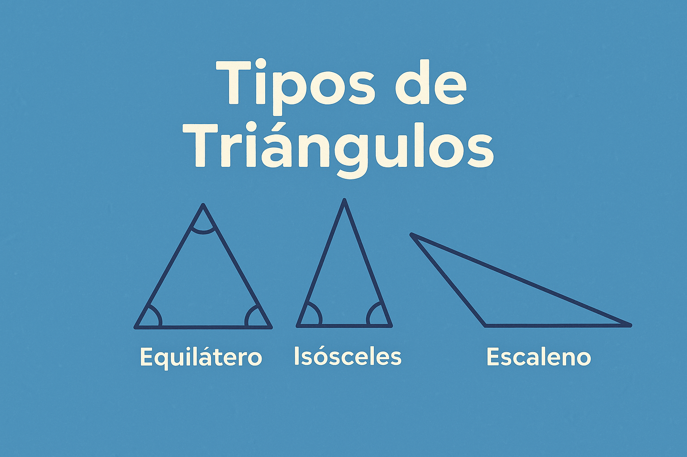

# Tipos de Triângulos

Este projeto em C# tem como objetivo identificar o tipo de triângulo a partir de três valores informados pelo usuário. Ele classifica o triângulo com base em suas medidas, determinando se ele é:

- **Não forma triângulo** (quando não atende à condição triangular)
- **Triângulo Retângulo**
- **Triângulo Obtusângulo**
- **Triângulo Acutângulo**
- **Triângulo Equilátero**
- **Triângulo Isósceles**

## 🧮 Lógica de funcionamento

O algoritmo segue os seguintes passos:
1. Lê três valores do tipo `float`.
2. Determina qual dos valores é o maior (para facilitar os cálculos de classificação).
3. Verifica se os lados formam um triângulo.
4. Classifica o triângulo conforme os ângulos:
   - Retângulo
   - Obtusângulo
   - Acutângulo
5. E depois conforme os lados:
   - Equilátero
   - Isósceles

## 💡 Exemplo de entrada e saída

**Entrada:**
7.0 5.0 7.0

makefile
Copiar
Editar

**Saída:**
TRIANGULO ACUTANGULO TRIANGULO ISOSCELES

yaml
Copiar
Editar

## 🛠️ Tecnologias

- .NET Core 3.1
- C#

Feito com 💻 por Danilo.
